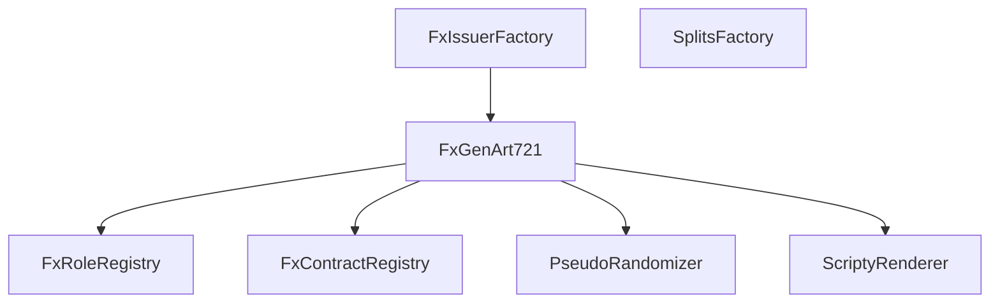

# fx(hash)

## Core Contracts

1. **[FxContractRegistry](https://github.com/fxhash/fxhash-core/blob/main/src/registries/FxContractRegistry.sol)**: Registry contract that manages all deployed smart contracts registered by **[fxhash](https://www.fxhash.xyz)**

2. **[FxGenArt721](https://github.com/fxhash/fxhash-core/blob/main/src/tokens/FxGenArt721.sol)**: `ERC-721` implementation contract that allows for minting of new tokens, burning of existing tokens and managing of token royalties

3. **[FxIssuerFactory](https://github.com/fxhash/fxhash-core/blob/main/src/factories/FxIssuerFactory.sol)**: Factory contract that clones the `FxGenArt721` implementation to create new Generative Art Projects

4. **[FxMintTicket721](https://github.com/fxhash/fxhash-core/blob/main/src/tokens/FxMintTicket721.sol)**: `ERC-721` implementation contract that allows for minting of new tickets, burning of exisiting tickets, and enforcing of harberger taxes over ticket ownership

5. **[FxRoleRegistry](https://github.com/fxhash/fxhash-core/blob/main/src/registries/FxRoleRegistry.sol)**: Registry contract that implements **[AccessControl](https://docs.openzeppelin.com/contracts/4.x/api/access)** to manage different roles within the system, such as admin, creator, minter, and moderator

6. **[FxTicketFactory](https://github.com/fxhash/fxhash-core/blob/main/src/factories/FxTicketFactory.sol)**: Factory contract that clones the `FxMintTicket721` implementation to create new Mint Tickets for an existing `FxGenArt721` project

## Periphery Contracts

1. **[DutchAuction](https://github.com/fxhash/fxhash-core/blob/main/src/minters/DutchAuction.sol)**: Minter contract that distributes new `FxGenArt721` and `FxMintTicket721` tokens at a linear price over a fixed interval of time

2. **[FixedPrice](https://github.com/fxhash/fxhash-core/blob/main/rc/minters/FixedPrice.sol)**: Minter contract that distributes new `FxGenArt721` and `FxMintTicket721` tokens at a fixed price

3. **[PseudoRandomizer](https://github.com/fxhash/fxhash-core/blob/main/src/randomizers/PseudoRandomizer.sol)**: Randomizer contract that provides a pseudo-randomness `keccak256` hash using the token ID, sender's address, current block number, and hash of the previous block

4. **[ScriptyRenderer](https://github.com/fxhash/fxhash-core/blob/main/src/renderers/ScriptyRenderer.sol)**: Renderer contract that generates and builds the metadata of a token fully onchain in `base64` format using **[Scripty.sol](https://int-art.gitbook.io/scripty.sol-v2)**

5. **[SplitsFactory](https://github.com/fxhash/fxhash-core/blob/main/src/factories/SplitsFactory.sol)**: Factory contract that creates and manages **[0xSplits](https://docs.splits.org)** contracts for distributing token royalties on primary and secondary sales

6. **[TicketRedeemer](https://github.com/fxhash/fxhash-core/blob/main/src/minters/TicketRedeemer.sol)**: Minter contract that burns an existing `FxMintTicket721` token and mints a new `FxGenArt721` token

## Architechture



## Setup

1. Clone repository

```
git clone https://github.com/fxhash/fxhash-evm-contracts.git
```

2. Create `.env` file in root directory

```
DEPLOYER_PRIVATE_KEY=
ETHERSCAN_API_KEY=
GOERLI_RPC_URL=
MAINNET_RPC_URL=
SEPOLIA_RPC_URL=
```

3. Install dependencies

```
forge install
```

```
npm ci
```

4. Activate husky and commitlint

```
npx husky install
npx husky add .husky/commit-msg  'npx --no -- commitlint --edit ${1}'
```

5. Run tests

```
npm run test
```

6. Run prettier

```
npm run prettier
```

7. Deploy contracts

```
forge script script/Deploy.s.sol --rpc-url $GOERLI_RPC_URL --private-key $DEPLOYER_PRIVATE_KEY --verify --etherscan-api-key $ETHERSCAN_API_KEY --broadcast
```

8. View documentation locally

```
forge doc --serve --port 3000
```
