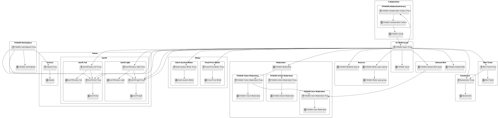

# FXHASH EVM Contracts

## Setup

1. Clone repository

```
git@github.com:fxhash/fxhash-evm-contracts.git
```

2. Create `.env` file in root directory

```
COIN_MARKET_CAP_API_KEY=
DEPLOYER_PRIVATE_KEY=
ETHERSCAN_API_KEY=
GOERLI_RPC_URL=
MAINNET_RPC_URL=
```

3. Install dependencies

```
npm ci
forge install
```

4. Run hardhat tests

```
npm run test
```

5. Run foundry tests

```
forge test
```

## Architecture


