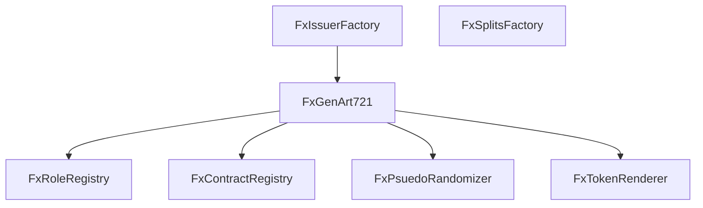

# FxHash Core Contracts

## Overview

1.  **[`FxContractRegistry`](src/registries/FxContractRegistry.sol#L8-L36)**: This contract maintains a registry of other contracts in the system. It maps the keccak256 hash of a contract's name to its address.

2.  **[`FxGenArt721`](src/tokens/FxGenArt721.sol#L28-L285)**: This contract is an implementation of the ERC721 standard for non-fungible tokens (NFTs). It includes additional functionality for minting tokens, burning tokens, and managing royalties. It also interacts with a randomizer contract to generate pseudo-random seeds for each token.

3.  **[`FxIssuerFactory`](src/factories/FxIssuerFactory.sol#L12-L77)**: This contract is responsible for creating new projects. It clones a given implementation of the `IFxGenArt721` interface and initializes it with the provided parameters. It also manages the configuration information and the mapping of project IDs to their corresponding contract addresses.

4.  **[`FxPsuedoRandomizer`](src/randomizers/FxPsuedoRandomizer.sol#L10-L25)**: This contract provides pseudo-randomness for the system. It has a function `requestRandomness` that generates a pseudo-random seed based on the provided token ID and then fulfills the seed request for the calling contract. The seed is generated in the `generateSeed` function, which uses the keccak256 hash of the token ID, the sender's address, the current block number, the current timestamp, and the hash of the previous block.

5.  **[`FxRoleRegistry`](src/registries/FxRoleRegistry.sol#L15-L31)**: This contract is an implementation of the `AccessControl` contract from the OpenZeppelin library. It is used to manage different roles within the system, such as admin, creator, minter, token moderator, and user moderator. The contract allows for setting role admins and granting roles to addresses.

6.  **[`FxSplitsFactory`](src/factories/FxSplitsFactory.sol#L11-L29)**: This contract is responsible for creating and managing split contracts. It provides two main functions: `createSplit` and `createVirtualSplit`. The `createSplit` function interacts with the `ISplitsMain` contract to create a new split contract with the provided accounts and allocations. The `createVirtualSplit` function predicts the address of a split contract that would be created with the provided accounts and allocations, and emits an event if the predicted address does not have any code associated with it.

7.  **[`FxTokenRenderer`](src/renders/FxTokenRenderer.sol)**: # This contract generates the token URI based on whether the project is stored on-chain or off-chain. If the project is stored off-chain, it simply concatenates the base URI with the token ID. If the project is stored on-chain, it uses the `renderOnchain` function to generate the on-chain data and encodes it in base64 format.

### Architechture



## Setup

1. Clone repository

```
git clone https://github.com/fxhash/fxhash-evm-contracts.git
```

2. Create `.env` file in root directory

```
DEPLOYER_PRIVATE_KEY=
ETHERSCAN_API_KEY=
GOERLI_RPC_URL=
MAINNET_RPC_URL=
SEPOLIA_RPC_URL=
```

3. Install dependencies

```
forge install
```

4. Run tests

```
forge test
```

5. Run prettier

```
npm run prettier
```

6. Deploy contracts

```
forge script script/Deploy.s.sol --rpc-url $GOERLI_RPC_URL --private-key $DEPLOYER_PRIVATE_KEY --verify --etherscan-api-key $ETHERSCAN_API_KEY --broadcast
```
