# Gates component specifications

Gates are abstract concepts defining a step in a list of rectrictions the user wants to go through when they want to perform a mint. This system is complex; it provides the ability to encode any case in a graph of gates. The front-end should be built to provide an easy way to build sensible graph of gates, while the ProjectFactory contract should be capable of only allowing certain patterns of graphs.

## Base Gate

We define the abstract entity Gate as a low-level entity any gate implementation must inherit to be a working Gate. Each Gate must implement is own `validate()` method, which specifies constraints and actions required to pass the Gate. Gates can also override the `next_issuer()` implementation if needs be, if they rely on a different set of atomic operations on the issuer. The base atomic opertion of the issuer called by `next_issuer()` is `safe_mint_iteration()`, which decrements the supply and mints an iteration.

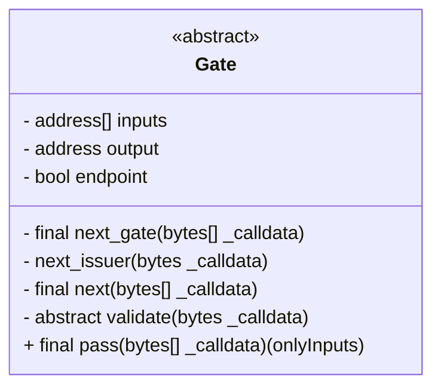
```mermaid
classDiagram
  class Gate {
    <<abstract>>
    %% a list of contract which can call this gate (if empty, any address valid)
    - address[] inputs
    %% next contract called by this gate
    - address output
    %% whether this gate is an endpoint; if so, it will be calling the issuer
    - bool endpoint
    %% internal fn to call the output as a gate
    - final next_gate(bytes[] _calldata)
    %% internal fn to call the output as the issuer
    - next_issuer(bytes _calldata)
    %% internal function to move forward
    - final next(bytes[] _calldata)
    %% internal function to validate an input
    - abstract validate(bytes _calldata)
    %% generic entry point which can be called to pass the gate
    %% one has to provide a list of the calldata bytes which will be required to
    %% pass this gate and all the other gates
    + final pass(bytes[] _calldata) (onlyInputs)
  }
```

Gates are composed as a graph, where each Gate defines a step in a process to move forward.

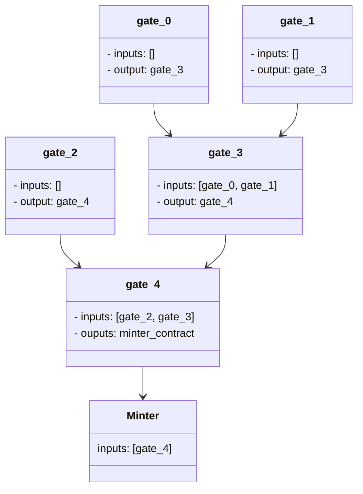
```mermaid
classDiagram
  gate_0 --> gate_3
  gate_1 --> gate_3
  gate_2 --> gate_4
  gate_3 --> gate_4
  gate_4 --> Minter

  class gate_0 {
    - inputs: []
    - output: gate_3
  }

  class gate_1 {
    - inputs: []
    - output: gate_3
  }

  class gate_2 {
    - inputs: []
    - output: gate_4
  }

  class gate_3 {
    - inputs: [gate_0, gate_1]
    - output: gate_4
  }

  class gate_4 {
    - inputs: [gate_2, gate_3]
    - ouputs: minter_contract
  }

  class Minter {
    inputs: [gate_4]
  }
```

Gates can be either atomic (implement a tiny feature) or fully featured (implement a set of requirements bundlded together). The following example demonstrates a same implementation using the atomic pattern and a compression pattern.

### Atomic (left) / Compressed (right)

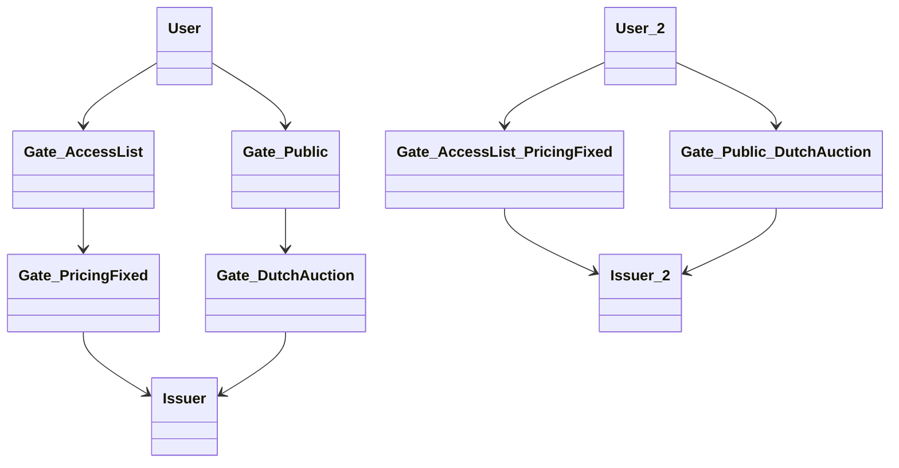
```mermaid
classDiagram
  User --> Gate_AccessList
  User --> Gate_Public
  Gate_AccessList --> Gate_PricingFixed
  Gate_Public --> Gate_DutchAuction
  Gate_PricingFixed --> Issuer
  Gate_DutchAuction --> Issuer

  class User {
  }
  class Gate_AccessList {
  }
  class Gate_PricingFixed {
  }
  class Gate_Public {
  }
  class Gate_DutchAuction {
  }
  class Issuer {
  }

  User_2 --> Gate_AccessList_PricingFixed
  User_2 --> Gate_Public_DutchAuction
  Gate_AccessList_PricingFixed --> Issuer_2
  Gate_Public_DutchAuction --> Issuer_2

  class User_2 {
  }
  class Gate_AccessList_PricingFixed {
  }
  class Gate_Public_DutchAuction {
  }
  class Issuer_2 {
  }
```

Both patterns implement the same features, and effectively the Gate abstraction isn't opiniated for one in favor of another. The next section will decribe which cases are the most suited for the different gates.

### Overview

#### Storage

- `inputs`: a list of addresses allowed to call the Gate. If no address is in the list, anyone can call the Gate
- `output`: a single address which is the single output of the Gate. If the gate is an endpoint, the address is the issuer, otherwise it's going to be the follow-up gate.
- `endpoint`: whether the gate is an endpoint; we need to know if the follow-up address is the issuer or not to trigger different actions

#### Methods

- `next_gate(bytes[] _calldata)` (**final**): calls the next gate by passing the rest of the calldata
- `next_issuer(bytes _calldata)`: calls the issuer, if the gate is at the end of the flow. Most gates will call `safe_mint_iteration` on the issuer, but some gates may want to call atomic operations on the issuer
- `next(bytes[] _calldata)` (**final**): is called by the pass function, will check whether the issuer or a gate should be called, and execute the appropriate internal function
- `validate(bytes _calldata)` (**abstract**): each gate implementation must implemention its own validation method. This method will implement everything required for the gate to determine if the call can move forward, or if an issue was met

* `pass(bytes[] _calldata)` (**final**): can only be called in one of the inputs, or any address if there are no inputs. Will execute the internal logic and call internal functions to process the execution flow of the gate. This method is generic and cannot be overridden.

### Internal flows

#### pass()

```mermaid
sequenceDiagram
  participant Caller
  participant pass()
  participant validate()
  participant next()
  participant next_gate()
  participant next_issuer()
  participant output

  Caller->>pass(): request pass, provide gates calldata[0,...,N]
  activate pass()
  opt if caller is not allowed
    pass()-xCaller: error: unauthorized
  end
  pass()->>pass(): gateData = calldata[0]
  activate validate()
  pass()->>validate(): validate(gateData)
  opt if gate can't be passed
    validate()-xCaller: error
  end
  validate()->>validate(): apply gate effects if any
  validate()-->>pass(): ok
  deactivate validate()
  pass()->>next(): move to next gate/issuer (pass calldata[1,...,N])
  deactivate pass()
  activate next()
  alt if gate is endpoint
    opt if calldata array size > 1
      next()-xCaller: error: there should only be 1 calldata left
    end
    next()->>next_issuer(): pass calldata[N]
    next_issuer()->>output: call relvant atomic operations on output
  else gate is not endpoint
    next()->>output: pass() with calldata[1,...,N]
  end
  deactivate next()
```

## Functional gates

The functional gates extend the base gate and provide features for all the required use cases of fxhash. This is a list of the features the gates have to support:

- pricing
  - fixed
  - tiered dutch auction
- reserves
  - access list
  - mint pass group
  - token burner
- base access control
  - supply
  - opening time
  - closing time
- special
  - tickets

When an issuer supports mint tickets, a special setup is required because we need the ticket gate to always be the last node of any path a user can take, and we need a permanent token burner pointing to the ticket contract on which the gate instanciate assets.

### Atomic Gates

This section will describe each Gate in an atomic way, and the features it must support.

#### Pricings

##### Fixed

A fix price, which must be paid to move forward.

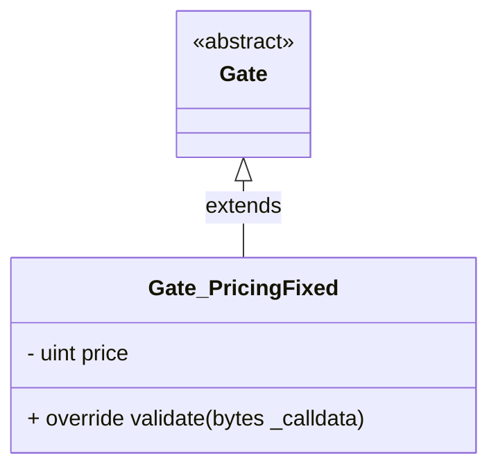
```mermaid
classDiagram
  Gate <|-- Gate_PricingFixed: extends

  class Gate {
    <<abstract>>
  }

  class Gate_PricingFixed {
    - uint price
    + override validate(bytes _calldata)
  }
```

###### Overrides

- `validate()`: simply checks if enough was provided in the transaction. If so, the gate can be passed. Also refunds if too much was paid.

##### Dutch Auction contracts

The dutch auction contracts all share similar properties, that is:

- the price of the auction can be locked (if configured by the author)
  - if configured, when public is done minting; people in the access list have to pay the same price
  - if configured, when the DA is finalized, users can ask for a refund of everything that was spent

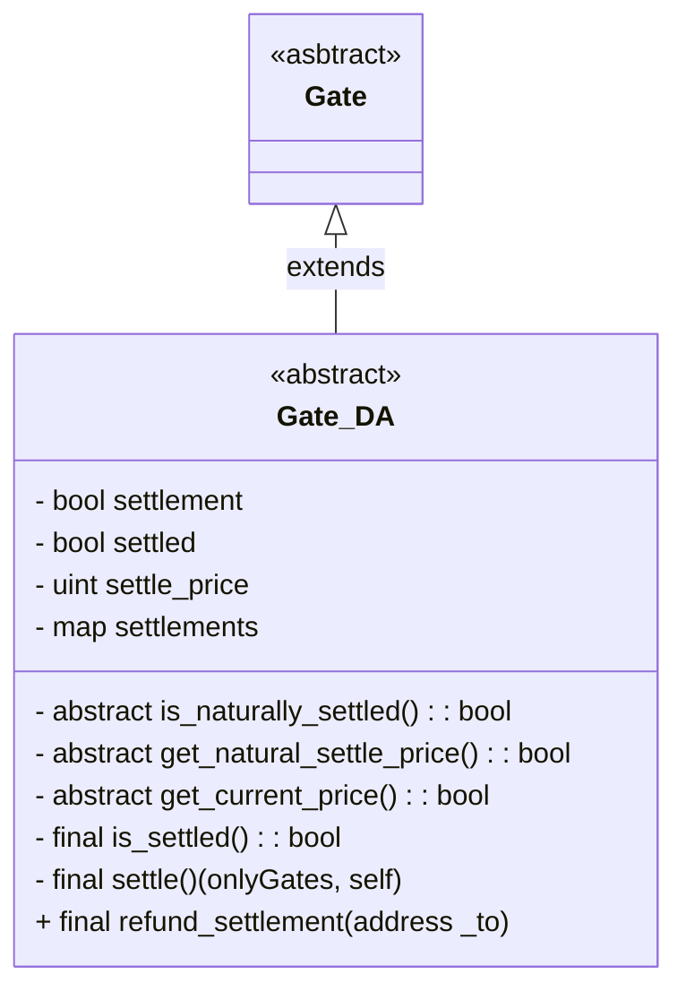
```mermaid
classDiagram
  Gate <|-- Gate_DA: extends

  class Gate {
    <<asbtract>>
  }

  class Gate_DA {
    <<abstract>>
    - bool settlement
    - bool settled
    - uint settle_price
    - map settlements
    - abstract is_naturally_settled(): bool
    - abstract get_natural_settle_price(): bool
    - abstract get_current_price(): bool
    - final is_settled(): bool
    - final settle() (onlyGates, self)
    + final refund_settlement(address _to)
  }
```

###### Overrides

- `settlement` whether the DA supports a settlement; allows buyers to be refund at the lowest DA price that was reached during the sale
- `settled`: whether the DA was manually settled as the result of an internal operation, because configured by the user
- `settled_price`: price of the DA when it was manually settled
- `settlements`: keeps track of the amount paid by the buyers to get past the Gate
- `is_naturally_settled()`: returns true if the gate has reach a natural settlement (basically when it has reached its resting price). This method should be overridden by the DA Gates.
- `get_natural_settle_price()`: returns the resting price of the auction
- `get_current_price()`: returns the current price for the auction
- `is_settled()`: returns true if the gate is locked (if settled is true or if it has naturally settled)
- `settle()`: can be called by other Gates to settle the Auction. Can also be called by the DA gate itself to auto-settle the auction
- `refund_settlement()`: (only when is_settled() yields true) allows users to withdraw the different between the final price and the settled_price

###### Sequence diagram

Minting:

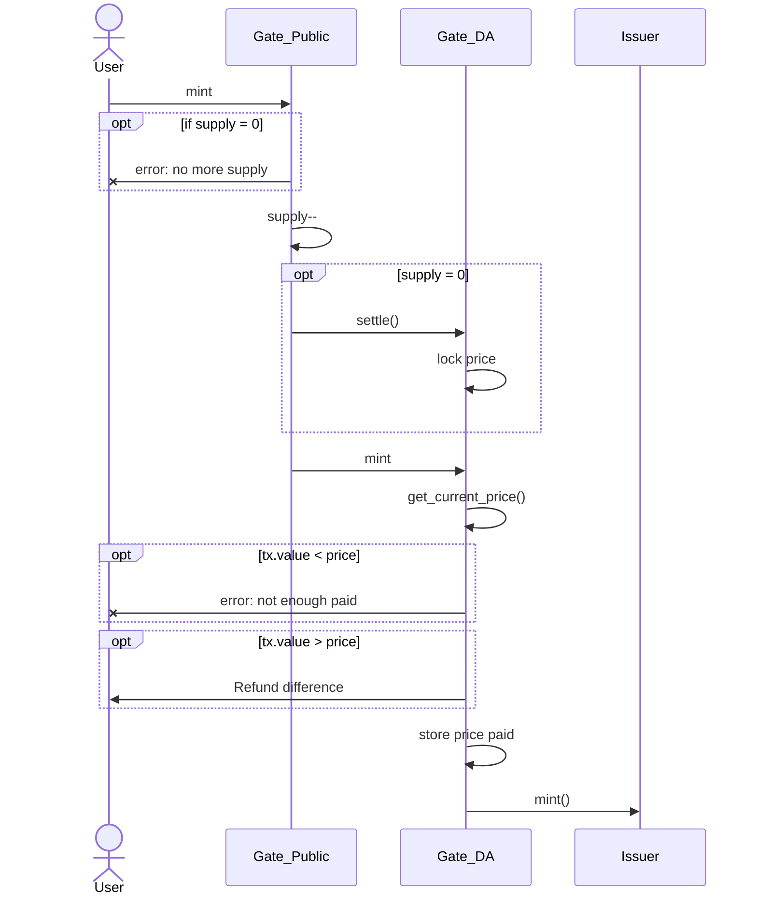
```mermaid
sequenceDiagram
  actor User
  participant Gate_Public
  participant Gate_DA
  participant Issuer

  User->>Gate_Public: mint
  opt if supply = 0
    Gate_Public-xUser: error: no more supply
  end
  Gate_Public->>Gate_Public: supply--
  opt supply = 0
    Gate_Public->>Gate_DA: settle()
    Gate_DA->>Gate_DA: lock price
  end
  Gate_Public->>Gate_DA: mint
  Gate_DA->>Gate_DA: get_current_price()
  opt tx.value < price
    Gate_DA-xUser: error: not enough paid
  end
  opt tx.value > price
    Gate_DA->>User: Refund difference
  end
  Gate_DA->>Gate_DA: store price paid
  Gate_DA->>Issuer: mint()
```

Refund:

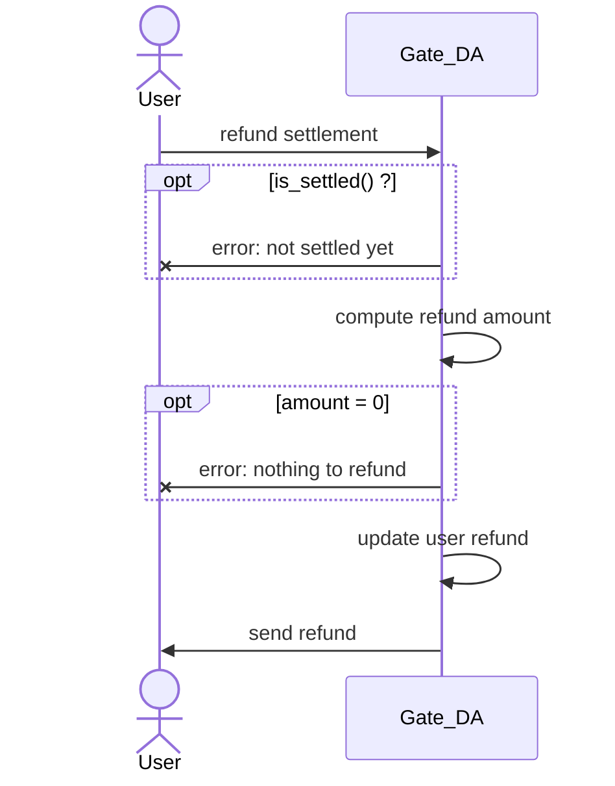
```mermaid
sequenceDiagram
  actor User
  participant Gate_DA

  User->>Gate_DA: refund settlement
  opt is_settled() ?
    Gate_DA-xUser: error: not settled yet
  end
  Gate_DA->>Gate_DA: compute refund amount
  opt amount = 0
    Gate_DA-xUser: error: nothing to refund
  end
  Gate_DA->>Gate_DA: update user refund
  Gate_DA->>User: send refund
```

##### Tiered Dutch Auction

An auction where a list of prices is defined, and based on the time one of the prices will be active. A time_between_tiers define how much time has to be spent to between the tiers. Such price must be paid to pass the gate.

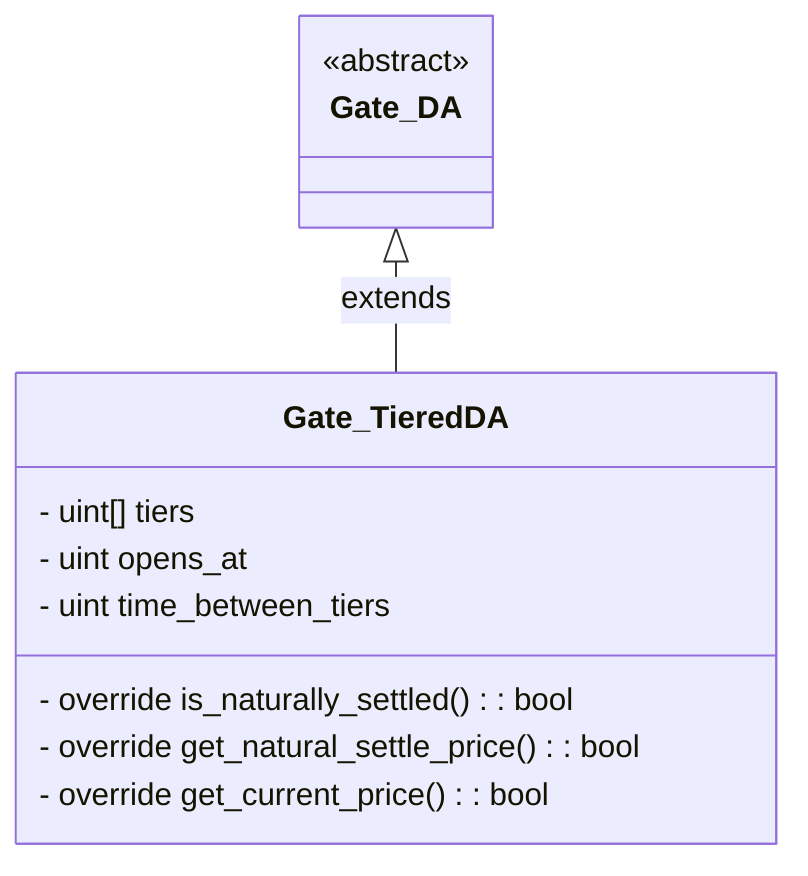
```mermaid
classDiagram
  Gate_DA <|-- Gate_TieredDA: extends

  class Gate_DA {
    <<abstract>>
  }

  class Gate_TieredDA {
    - uint[] tiers
    - uint opens_at
    - uint time_between_tiers
    - override is_naturally_settled(): bool
    - override get_natural_settle_price(): bool
    - override get_current_price(): bool
  }
```

###### Overrides

- `tiers`: a list of the prices which will change as time goes by. The last price of this list is the final price.
- `opens_at`: time at which the auction starts
- `time_between_tiers`: seconds between each tier
- `validate()`: Computes the price at a current block time. Then checks if enough was provided in the transaction. If so, the gate can be passed. Also refunds if too much was paid.
- `is_naturally_settled()`: if now > opens_at + tiers.length \* time_between_tiers
- `get_natural_settle_price()`: tiers.last
- `get_current_price()`: compute current tier, return its price

#### Reserves

##### Access List

The minter must be in a list created by authors to pass the Gate. We use a merkle proof to optimize storage costs for the authors.

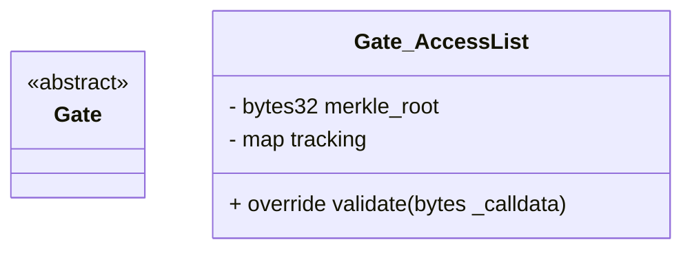
```mermaid
classDiagram

  class Gate {
    <<abstract>>
  }

  class Gate_AccessList {
    - bytes32 merkle_root
    - map tracking
    + override validate(bytes _calldata)
  }
```

###### Overrides

- `merkle_root`: the root of the merkle tree
- `tracking`: keeps track of users who went through the gate, to make sure they can't abuse the merkle proof
- `validate(bytes _calldata)`: takes the merkle proof as an input, validates it against the root

###### Sequence diagram

Create a merkle tree, create the Gate.

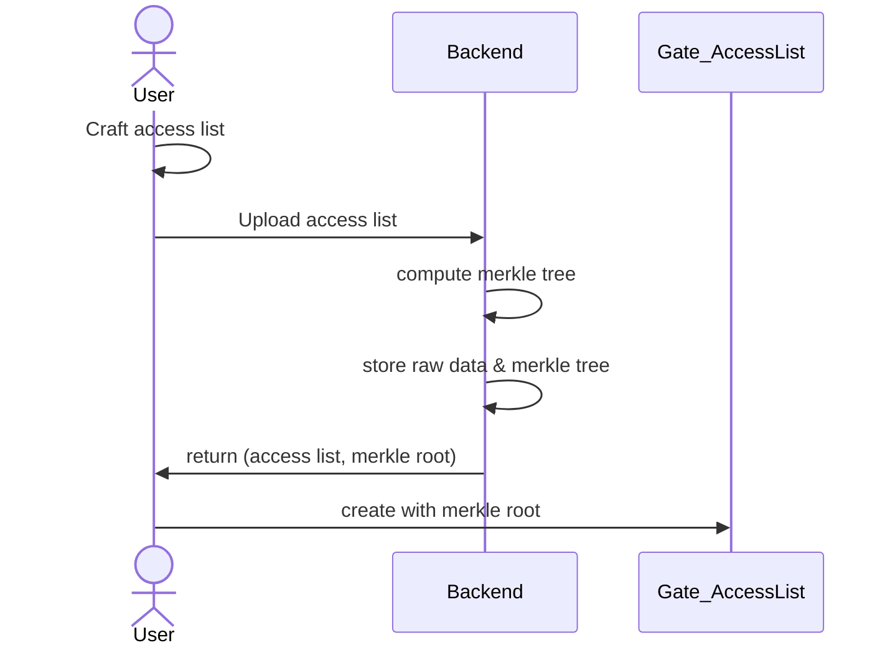
```mermaid
sequenceDiagram
  actor User
  participant Backend
  participant Gate_AccessList

  User->>User: Craft access list
  User->>Backend: Upload access list
  Backend->>Backend: compute merkle tree
  Backend->>Backend: store raw data & merkle tree
  Backend->>User: return (access list, merkle root)
  User->>Gate_AccessList: create with merkle root
```

Mint using merkle proof

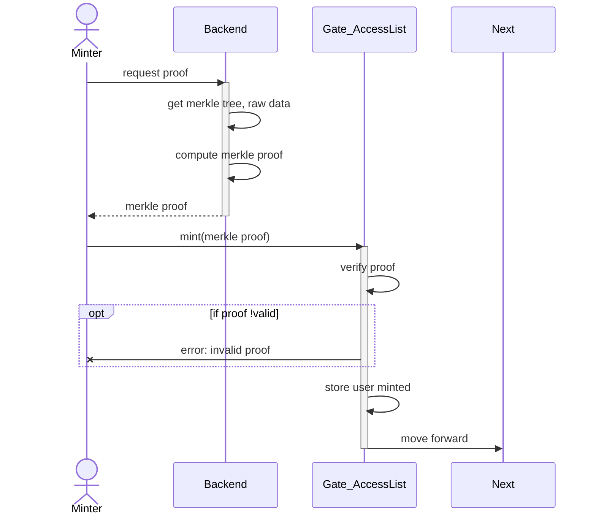
```mermaid
sequenceDiagram
  actor Minter
  participant Backend
  participant Gate_AccessList
  participant Next

  Minter->>Backend: request proof
  activate Backend
  Backend->>Backend: get merkle tree, raw data
  Backend->>Backend: compute merkle proof
  Backend-->>Minter: merkle proof
  deactivate Backend
  Minter->>Gate_AccessList: mint(merkle proof)
  activate Gate_AccessList
  Gate_AccessList->>Gate_AccessList: verify proof
  opt if proof !valid
    Gate_AccessList-xMinter: error: invalid proof
  end
  Gate_AccessList->>Gate_AccessList: store user minted
  Gate_AccessList->>Next: move forward
  deactivate Gate_AccessList
```

##### Mint Pass Group

The Mint Pass group contract is designed to provide some ability to have a backend as an authority to control access to the Gate, using different off-chain strategies.

Admins will originate new Mint Pass groups with special rules, and for events artists will have to input the Mint Pass group corresponding to the event at the creation of the project (or when the project is live).

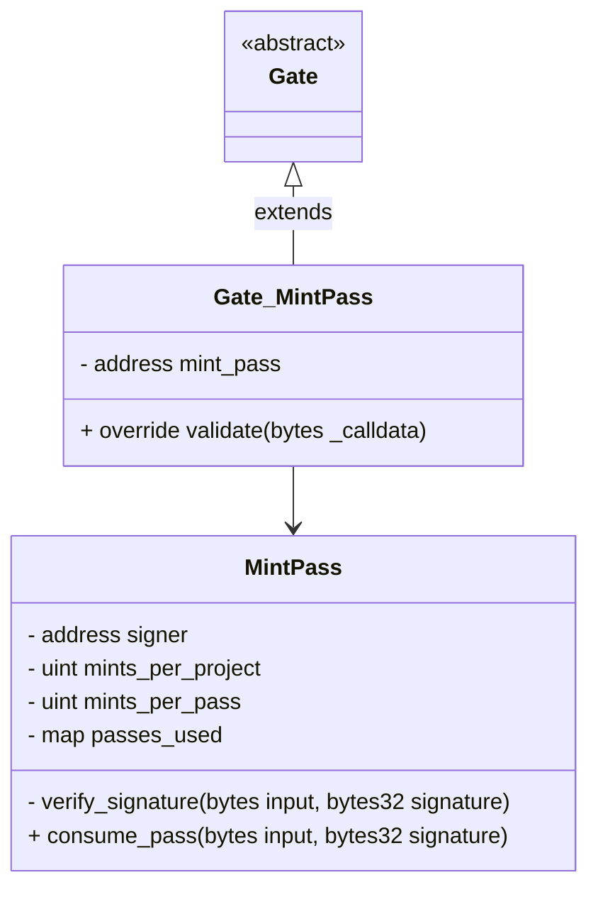
```mermaid
classDiagram
  Gate <|-- Gate_MintPass: extends
  Gate_MintPass --> MintPass

  class MintPass {
    - address signer
    - uint mints_per_project
    - uint mints_per_pass
    - map passes_used
    - verify_signature(bytes input, bytes32 signature)
    + consume_pass(bytes input, bytes32 signature)
  }

  class Gate {
    <<abstract>>
  }

  class Gate_MintPass {
    - address mint_pass
    + override validate(bytes _calldata)
  }
```

###### Overrides

- `mint_pass`: address of the mint pass contract
- `validate()`: needs to call the mint pass contract to verify the signature, and verify if the token can be used

###### Sequence diagrams

Admin generate a mint pass contract.

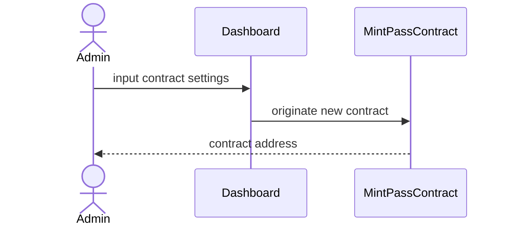
```mermaid
sequenceDiagram
  actor Admin
  participant Dashboard
  participant MintPassContract

  Admin->>Dashboard: input contract settings
  Dashboard->>MintPassContract: originate new contract
  MintPassContract-->>Admin: contract address
```

Artist add mint pass group to their project

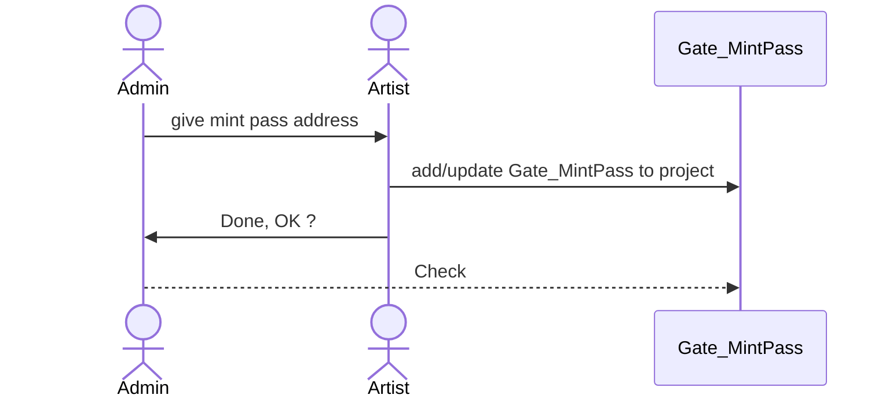
```mermaid
sequenceDiagram
  actor Admin
  actor Artist
  participant Gate_MintPass

  Admin->>Artist: give mint pass address
  Artist->>Gate_MintPass: add/update Gate_MintPass to project
  Artist->>Admin: Done, OK ?
  Admin-->>Gate_MintPass: Check
```

Flow of consuming a mint pass

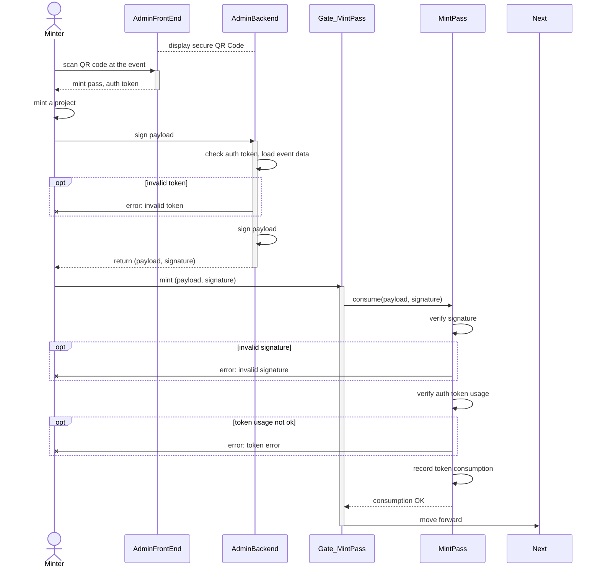
```mermaid
sequenceDiagram
  actor Minter
  participant AdminFrontEnd
  participant AdminBackend
  participant Gate_MintPass
  participant MintPass
  participant Next

  AdminFrontEnd-->AdminBackend: display secure QR Code
  Minter->>+AdminFrontEnd: scan QR code at the event
  AdminFrontEnd-->>-Minter: mint pass, auth token
  Minter->>Minter: mint a project
  Minter->>AdminBackend: sign payload
  activate AdminBackend
  AdminBackend->>AdminBackend: check auth token, load event data
  opt invalid token
    AdminBackend-xMinter: error: invalid token
  end
  AdminBackend->>AdminBackend: sign payload
  AdminBackend-->>Minter: return (payload, signature)
  deactivate AdminBackend
  Minter->>Gate_MintPass: mint (payload, signature)
  activate Gate_MintPass
  Gate_MintPass->>MintPass: consume(payload, signature)
  MintPass->>MintPass: verify signature
  opt invalid signature
    MintPass-xMinter: error: invalid signature
  end
  MintPass->>MintPass: verify auth token usage
  opt token usage not ok
    MintPass-xMinter: error: token error
  end
  MintPass->>MintPass: record token consumption
  MintPass-->>Gate_MintPass: consumption OK
  Gate_MintPass->>Next: move forward
  deactivate Gate_MintPass
```

##### Token Burner

The Token Burner Gate implements a generic interface to burn IERC5679Ext721 tokens. It's pretty straighforward.

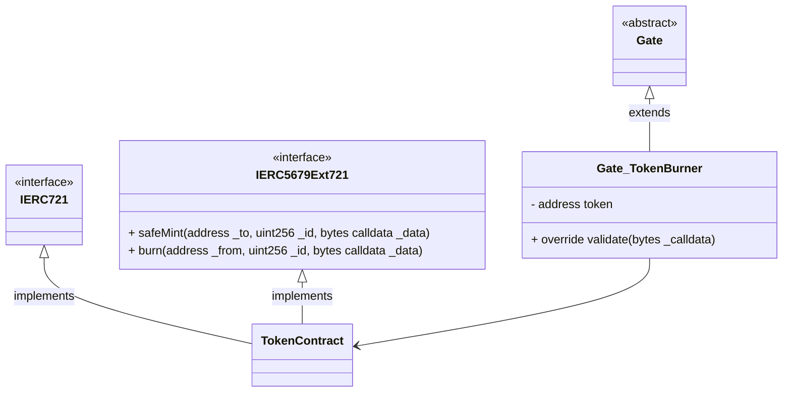
```mermaid
classDiagram
  IERC721 <|-- TokenContract: implements
  IERC5679Ext721 <|-- TokenContract: implements
  Gate <|-- Gate_TokenBurner: extends
  Gate_TokenBurner --> TokenContract

  class IERC721 {
    <<interface>>
  }

  class IERC5679Ext721 {
    <<interface>>
    + safeMint(address _to, uint256 _id, bytes calldata _data)
    + burn(address _from, uint256 _id, bytes calldata _data)
  }

  class TokenContract {
  }

  class Gate {
    <<abstract>>
  }

  class Gate_TokenBurner {
    - address token
    + override validate(bytes _calldata)
  }
```

###### Overrides

- `token`: the address of a IERC5679Ext721-compliant contract
- `validate()`: will try to burn the provided asset on the token contract

###### Sequence diagrams

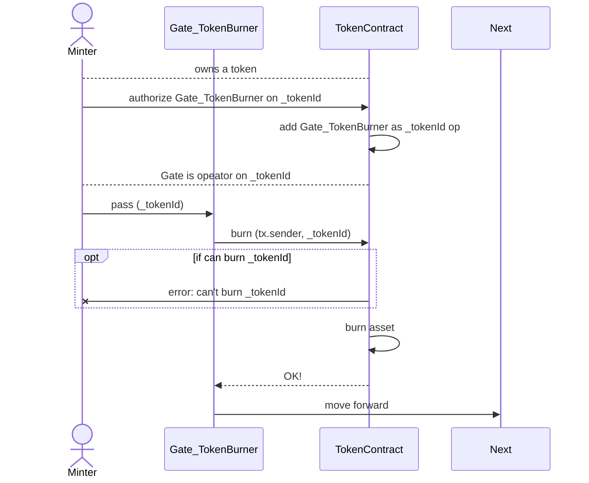
```mermaid
sequenceDiagram
  actor Minter
  participant Gate_TokenBurner
  participant TokenContract

  Minter-->TokenContract: owns a token
  Minter->>TokenContract: authorize Gate_TokenBurner on _tokenId
  TokenContract->>TokenContract: add Gate_TokenBurner as _tokenId op
  TokenContract-->Minter: Gate is opeator on _tokenId
  Minter->>Gate_TokenBurner: pass (_tokenId)
  Gate_TokenBurner->>TokenContract: burn (tx.sender, _tokenId)
  opt if can burn _tokenId
    TokenContract-xMinter: error: can't burn _tokenId
  end
  TokenContract->>TokenContract: burn asset
  TokenContract-->>Gate_TokenBurner: OK!
  Gate_TokenBurner->>Next: move forward
```

#### Base access control

The access control Gates define simple atomic conditions.

##### Supply

The Gate supply controls a quantity which can pass through the gate. Once the quantity is 0, the Gate cannot be passed.

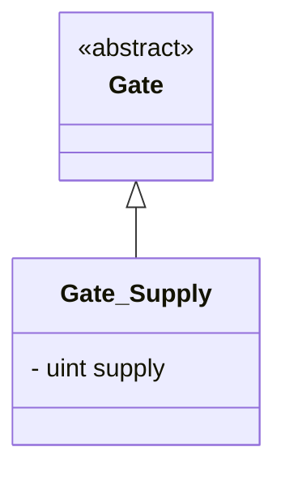
```mermaid
classDiagram
  Gate <|-- Gate_Supply

  class Gate {
    <<abstract>>
  }
  class Gate_Supply {
    - uint supply
  }
```

###### Overrides

- `validate()`: if supply > 0, decrement supply

###### Sequence

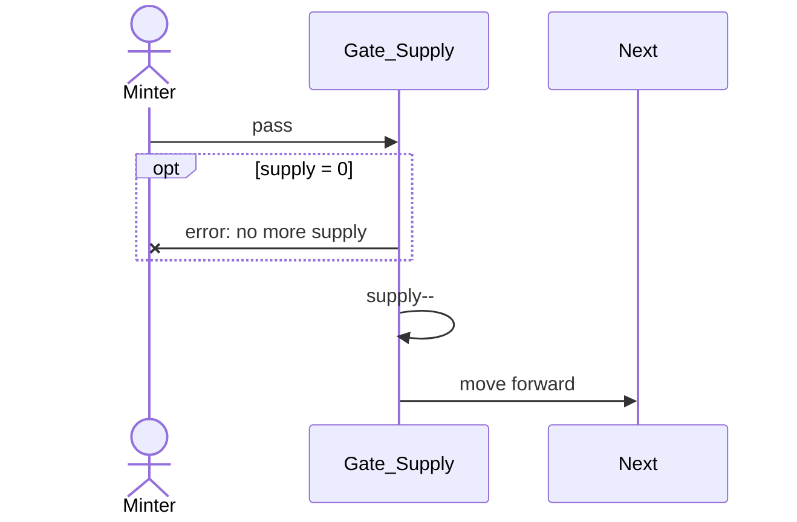
```mermaid
sequenceDiagram
  actor Minter
  participant Gate_Supply
  participant Next

  Minter->>Gate_Supply: pass
  opt supply = 0
    Gate_Supply-xMinter: error: no more supply
  end
  Gate_Supply->>Gate_Supply: supply--
  Gate_Supply->>Next: move forward
```

##### Opening time

The Gate OpeningTime checks if time is after now.

```mermaid
classDiagram
  Gate <|-- Gate_OpeningTime

  class Gate {
    <<abstract>>
  }
  class Gate_OpeningTime {
    - uint opening_time
  }
```

###### Overrides

- `validate()`: now >= opening_time

###### Sequence

```mermaid
sequenceDiagram
  actor Minter
  participant Gate_OpeningTime
  participant Next

  Minter->>Gate_OpeningTime: pass
  opt block.timestamp < opening_time
    Gate_OpeningTime-xMinter: error: no opened yet
  end
  Gate_OpeningTime->>Next: move forward
```

##### Closing time

The Gate ClosingTime checks if now is before closing time.

```mermaid
classDiagram
  Gate <|-- Gate_ClosingTime

  class Gate {
    <<abstract>>
  }
  class Gate_ClosingTime {
    - uint closing_time
  }
```

###### Overrides

- `validate()`: now < closing_time

###### Sequence

```mermaid
sequenceDiagram
  actor Minter
  participant Gate_ClosingTime
  participant Next

  Minter->>Gate_ClosingTime: pass
  opt block.timestamp >= closing_time
    Gate_ClosingTime-xMinter: error: closed
  end
  Gate_ClosingTime->>Next: move forward
```

---

#### Specials

Special gates are hard to classify, and have a particular behaviour.

##### Tickets

The Gate Ticket can be used by any project which want to support Tickets. The Gate Ticket provides a branching out, and give users the ability to either mint an iteration, or a ticket of their asset.

This Gate must be used in conjonction with a Token Burner gate, with a Token contract.

This Gate **must be placed at the end of all the Gates**, because Tickets can be bought using any available pricing strategy.

```mermaid
classDiagram
  Gate <|-- Gate_Tickets: extends
  Gate <|-- Gate_TokenBurner: extends
  Gate_TokenBurner --> TokenContract_IERC5679Ext721
  Gate_Tickets --> TokenContract_IERC5679Ext721

  class TokenContract_IERC5679Ext721 {
  }

  class Gate {
    <<abstract>>
  }

  class Gate_Tickets {
    - address tickets
    - override next_issuer(bytes _calldata)
    - override validate(bytes _calldata)
  }

  class Gate_TokenBurner {

  }
```

###### Overrides

- `tickets`: address of the tickets contract
- `next_issuer()`: depending on the issuer input, either triggers the mint of a ticket or the mint of an iteration
- `validate()`: does nothing

###### Sequence diagrams

Minting a ticket

```mermaid
sequenceDiagram
  actor Minter
  participant Gate_Tickets
  participant Issuer
  participant TicketContract

  Minter->>Gate_Tickets: request mint
  alt request a ticket
    Gate_Tickets->>TicketContract: mint
    Gate_Tickets->>Issuer: decrement_supply
  else request a mint
    Gate_Tickets->>Issuer: safe_mint_iteration
  end
```

## Explorations

What if we defined the nodes

```solidity
// stores the entry points to the Gate tree
bytes32[] entry_gates
// stores the nodes in a hashmap
mapping(bytes32 => Gate) gates

// a mapping of Gate type -> implementation
// tbd: how do we map to a fn_pointer where the gate is implemented
mapping(uint => fn_pointer)

struct Gate {
  // parents of this gate
  parents: bytes32[]
  // output
  output: bytes32
  // the type of the gate; maps to its implementation
  uint type
  // the settings of the Gate, depends on its type
  bytes settings
  // storage of the Gate
  // todo: how do we define the storage, encoded as bytes is inneficient is
  // pretty limited (storing mappings into bytes :/)
  bytes data
}
```

With this kind of implementation, users could provide a tree of gates they want to use, and the "GateManager" would be responsible for parsing the tree and execute the right functions.

There should also be a validator, which checks if all the potential paths are valid.

# To be defined

- how do gates inform the issuer an amount was paid, and needs to be distributed ? how do we pass this data
- similarly, some gates can have some control over the next gates. For instance, the DA gates are lockable if
- which gates do we compress ? (for instance supply can be implemented into many gates to simplify)
  - **!careful!**: compressing the Gates will result in an exponential number of implementation if not done properly
- can we turn the atomic gate components into simple functions we parse using a tree stored in-memory of a core contract

# Edge cases to explore

- 2 reserves: public & access list; when the public is done minting, we want to lock the price of the dutch auction to the last price by the public (so that people in the access list must pay the same price, they don't have to wait until resting price to mint)

# TODO

- draft edge cases for Steven
- give the input data

- Access list 20
- Public 100 - DA 100 -> 20
  0 50

- AccessList_Public_DA ->
