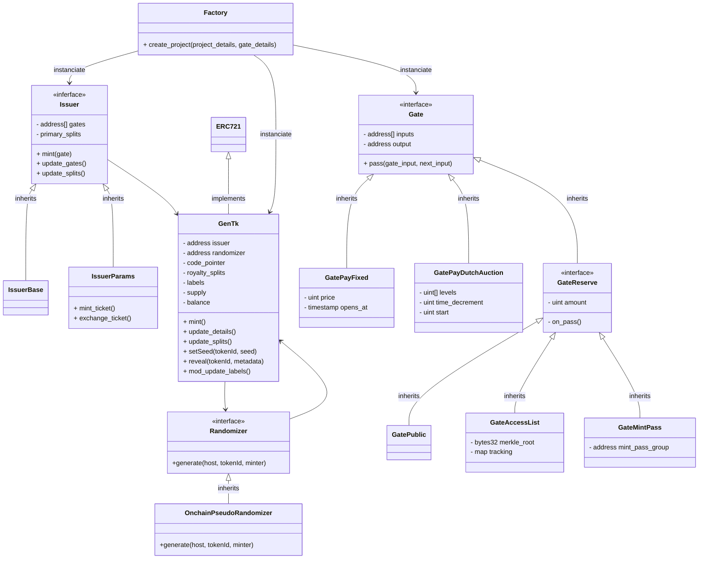

```mermaid
classDiagram
  %% relations between issuers
  Issuer <|-- IssuerBase : inherits
  Issuer <|-- IssuerParams : inherits
  ERC721 <|-- GenTk : implements
  Issuer --> GenTk
  Randomizer <|-- OnchainPseudoRandomizer: inherits
  GenTk --> Randomizer
  Randomizer --> GenTk
  Factory --> Issuer : instanciate
  Factory --> GenTk : instanciate
  Factory --> Gate : instanciate
  %% gates
  Gate <|-- GatePayFixed : inherits
  Gate <|-- GatePayDutchAuction : inherits
  Gate <|-- GateReserve : inherits
  GateReserve <|-- GatePublic : inherits
  GateReserve <|-- GateAccessList : inherits
  GateReserve <|-- GateMintPass: inherits

  class Factory {
    + create_project(project_details, gate_details)
  }

  class Issuer {
    <<inferface>>
    - address[] gates
    - primary_splits
    + mint(gate)
    + update_gates()
    + update_splits()
  }

  class IssuerBase {

  }

  class IssuerParams {
    + mint_ticket()
    + exchange_ticket()
  }

  class GenTk {
    - address issuer
    - address randomizer
    - code_pointer
    - royalty_splits
    - labels
    - supply
    - balance
    + mint()
    + update_details()
    + update_splits()
    + setSeed(tokenId, seed)
    + reveal(tokenId, metadata)
    + mod_update_labels()
  }

  class Randomizer {
    <<interface>>
    +generate(host, tokenId, minter)
  }

  class OnchainPseudoRandomizer {
    +generate(host, tokenId, minter)
  }

  class Gate {
    <<interface>>
    - address[] inputs
    - address output
    + pass(gate_input, next_input)
  }

  class GatePayFixed {
    - uint price
    - timestamp opens_at
  }

  class GatePayDutchAuction {
    - uint[] levels
    - uint time_decrement
    - uint start
  }

  class GateReserve {
    <<interface>>
    - uint amount
    - on_pass()
  }

  class GateAccessList {
    - bytes32 merkle_root
    - map tracking
  }

  class GateMintPass {
    - address mint_pass_group
  }

  class GatePublic {
  }
```