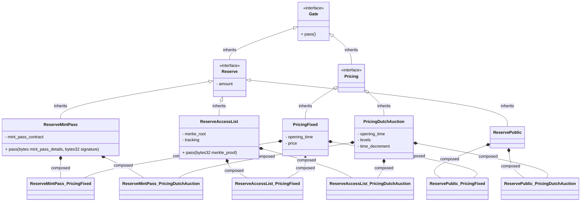

# Overall architecture diagram

## Gates (Reserves & Pricings)

> The Gates are used as entry points to the Issuer, they act as a filter for accessing a mint. In the next architecture diagrams, Gates will be referred to as Gates; the concept englobes all the Pricing & Reserve mechanism which are abstracted from the rest of the application.

### Design

Reserves & Pricing have the following options:

- Reserves
  - Public (fully open)
  - Mint Pass
  - Access List
- Pricings
  - Fixed
  - Dutch Auction

To optimize gas & provide a simple entry point for the minting interface, a composability pattern will be used, where there will be one contract for every combination of Reserve & Pricing possible:

| Pricings \ Reserves | Public              | Mint Pass             | Access List             |
| ------------------- | ------------------- | --------------------- | ----------------------- |
| **Fixed**           | Public_Fixed        | MintPass_Fixed        | AccessList_Fixed        |
| **Dutch Auction**   | Public_DutchAuction | MintPass_DutchAuction | AccessList_DutchAuction |

### Diagram



## Seed generation: Randomizer

To each GenTk will be associated a Randomizer implementation which will be responsible for handling the generation & reveal of the seed.

### Class diagram


### Sequence diagram


The implementation is agnostic of the synchronicity process of the reveal mechanism; the GenTk makes a request for a seed and expects the Randomizer to eventually resolve with a seed down the line.

## [WIP] Project architecture

> This architecture provides a high level overview; it doesn't factor the creation pattern nor the implementation pattern of the contracts.


### Sequence diagrams

TODO

#### Mint

#### Mint a ticket

#### Exchange a ticket

#### ...

### Notes

- supply & balance sit on the issuer
  - the issuer is responsible for knowing if a mint can go through or not
  - the GenTk only stores the iteraion_count; it's agnostic of whether a mint can be done, if it receives a mint() request from the issuer it passes it down
- a state of a project (NONE, FLAGGED, BANNED, BLOCKED... etc) now sits in the GenTk contract
  - there is no need for a moderation contract, thus reducing the costs to mint for everyone (calling a contract replaced by getting the state)
  - note: it could also sit on the Issuer contract; TBD

## Instanciate a new project: Factory pattern

New projects are instanciated on-chain using a Factory contract, which is responsible for spawing a suite of contracts required

### Class diagram


To optimize origination costs for the artists, a proxy pattern is used for the Issuer, GenTk and IssuerTickets contracts. Some inputs are provided to the Factory to determine which kind of project should be originated, the Factory will have internal logic to spawn the necessary contracts in a proper way.

### Sequence diagrams

#### Create a new project

```mermaid
sequenceDiagram
  actor User
  participant Factory

  User->>Factory: Create project
  create participant Carl
  Factory->>Issuer: Instanciate
  create participant GenTk
  Factory->>GenTk: Instanciate
```

### Notes

- there are some circular dependencies (issuer<->gentk, gates<->issuer, etc...), how exactly can this be implemented onchain ?
- it's worth to examine whether we instanciate a new gate per project, or if we use an ID-reference in a central Gate contract, where a new entry is created instead. Need to see what's more optimized
- optimization angle:
  - the mint() entry points could be fully instanciated, to avoid having a DELEGATE_CALL to the implementation; this would shift the costs of all the mints() towards the authors of a project which would pay to store the mint() functions entirely
