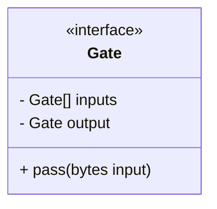
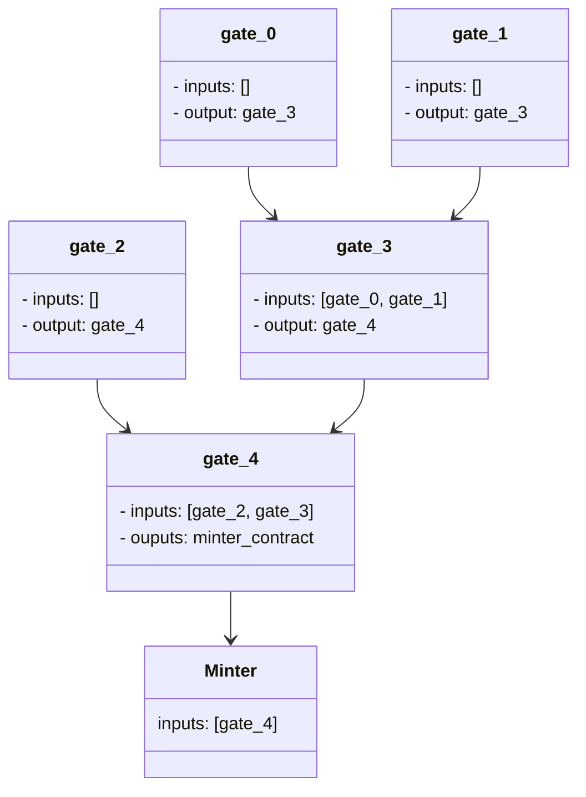
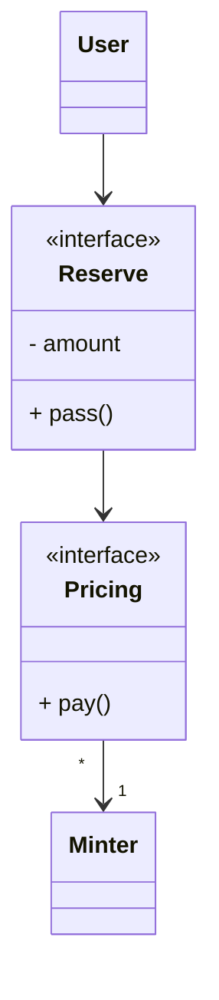
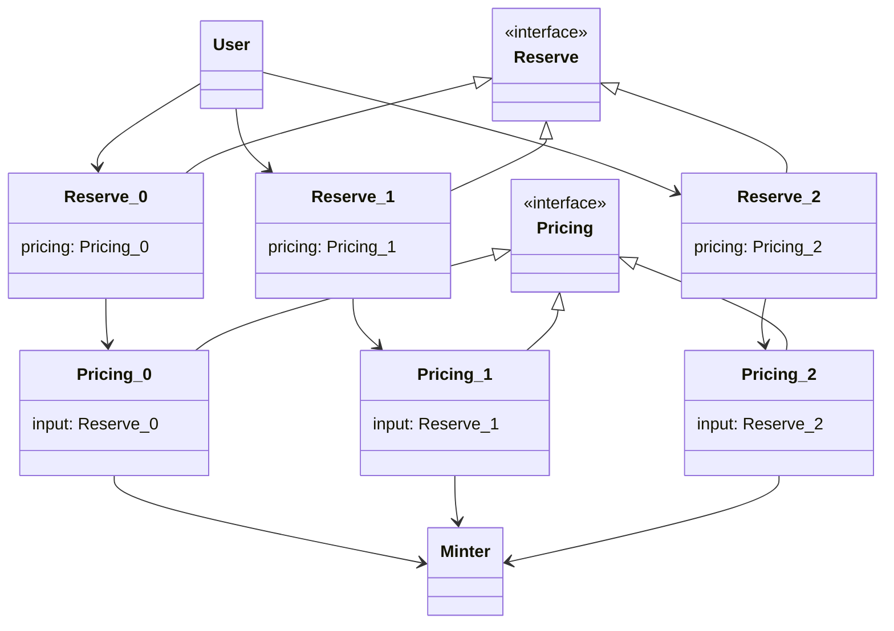
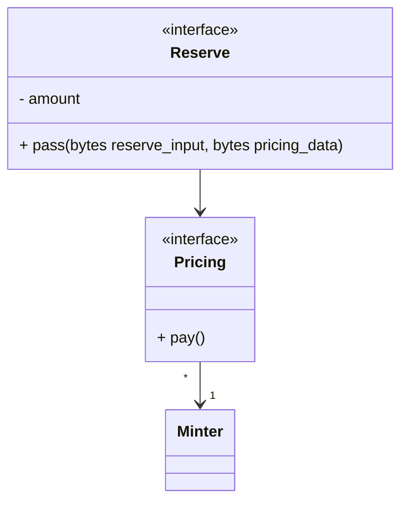
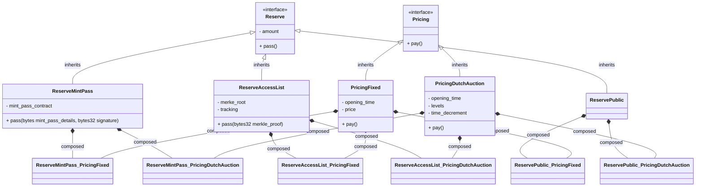
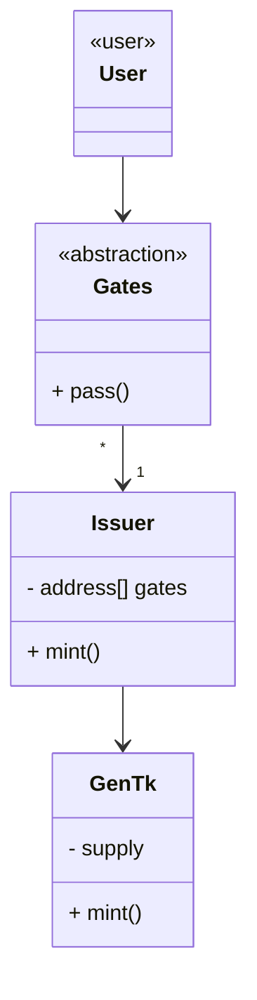
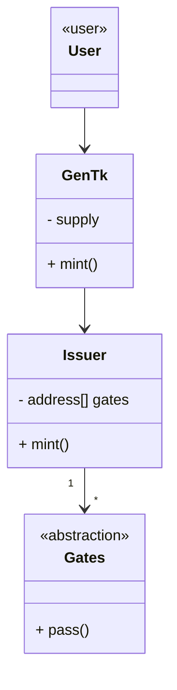

# ETH Contracts architecture

## Reserves & Pricing

### As a reminder

- **Reserves**: define a subset of iterations which can be minted under particular access
- **Pricing**: define how much needs to be spent to move forward in the minting process

### 1. Generic pattern for Reserves & Pricing

When looking at Reserves & Pricing in an abstract way, we can identify core differences:

- Reserves define how a subset of iterations can be access, given particular rules
- Pricing specify how much has to be paid 
 
But we can identify core similarities between both:

- they require a set of conditions to be met, often as the form of a validating a set of inputs
- they grant access to move forward in a process

In essence, when abstracting Reserves & Pricing, we can define a high order abstraction (which we'll call Gate) that describes how any of these components behaves at a high level.



#### 2. Gates composed as a Graph

By abstracting the concept of Gates, we can now define a system in which any Gate can be chained to another, following particular constraints:

- a Gate has **one output**: the output will be a contract which will be called if the Gate was successfully passed by the caller
- a Gate can have [0; N] other input Gates
  - input Gates define which contracts are allowed to call a gate
  - if a Gate doesn't have any input Gate, it can be called by any account

These principles lay the ground for Gates to be composed as a graph of Gates, where each node is agnostic of the behavior of its neighbors.



In this example, `gate_0`, `gate_1` and `gate_2` don't have any input, as such they can be called by any account. These gates are the **entry points** of the Gates system; these are the Gate the application will interact with to interact with the minter at the end of the Gates.

Due to the specifications of the graph, the gates available as inputs will always resolve to a predefined path, as nodes in this graph can only have 1 output node:
- `gate_0`: `0` -> `3` -> `4` -> `minter`
- `gate_1`: `1` -> `3` -> `4` -> `minter`
- `gate_2`: `2` -> `4` -> `minter`

#### Information flow

Gates may require data as an input to be passed. However, because each Gate is unaware of its surroundings, we must provide a polymorhpic way to pass data through each Gate. Each Gate however, will be responsible for extracting its data and passing the rest to the following gate.

Using the previous graph as an example, we can illustrate how data will be passed through the graph. Let's say that we want to use `gate_0` as our entry node, then we need to somehow pass data for the full path: `0` -> `3` -> `4` -> `minter`

Data can be stored as bytes, and can be concatenated so that each node can extract the data it needs and pass the rest when it's passed.

Example:

```
gate_0 requires an address (20 bytes)
gate_3 requires an int (32 bytes)
gate_4 requires an address & a number (52 bytes)
minter requires various data (256 bytes)

Data example:
full bytes: | 20 bytes | 32 bytes | 52 bytes | 256 bytes |

When calling gate_0, we need to pass the full data. Each node would extract the data it needs and pass it down:

gate_0:
  in:        | 20 | 32 | 52 | 256 |
  extract:   |----|
  out:       | 32 | 52 | 256 |
gate_3:
  in:        | 32 | 52 | 256 |
  extract:   |----|
  out:       | 52 | 256 |
gate_4:
  in:        | 52 | 256 |
  extract:   |----|
  out:       | 256 |
minter:
  in:        | 256 |
```

#### Problem with this architecture

This achitecture, while allowing full versatility on what projects can implement as minting strategies, requires the front-end to craft precise byte sequences based on the input Gate they want to target. Front-end will have to be aware of the full path one wants to take when going through the gates and will be responsible for crafting the required sequence of bytes. Moreover, it implies that the data will always be passed as bytes which requires carefulness in implementation.

It should be noted, however, in most cases Gates won't require any input and will just compute a price and lock the funds. So in essence most of the time it will just pass the whole input down in the chain.

### 3. Decoupling of Reserves & Pricing 

While the generic pattern for Reserves & Pricing is elegant, it's input requirements make it paricularly tricky to work with, especially on the front end. It is possible to greatly simplify the proposed pattern by typing Reserves & Pricing separately and by constraining the flow in which they are executed.



This pattern is much stricter as a Pricing contract must be attached to a Reserve contract, but there can only be one Reserve contract and one Pricing contract chained together. It is still possible to have multiple entry points just like the previous example:



#### Information flow

Similarly to the previous example, we need to pass the data for each component down the chain, as such we need a similar pattern as before, although it can be slightly optimized because we only need 1 reserve data and 1 pricing data per mint call.



It should be noted that although the `reserve_input` parameter was speficied as bytes, it can be typed as there won't be components above the reserve (dapp will communicate directly with those).

#### Overview

- **Pros**
  - the way data is passed down the chain can be optimized
  - the system can be extended as needed; eventually the Minter is still agnostic of the different minting logics, so we can extend the system in any way we see fit
- **Cons**
  - slight loss in composability, as it's not possible to chain multiple Reserves for instance (which is not a common pattern)

### Feature compression with composability

We can observe that, with the above solutions, in any case based on the entry point picked by the user at mint time, the execution will always go the same path. If for instance we take the 3 paths we studied in the first design:

- `gate_0`: `0` -> `3` -> `4` -> `minter`
- `gate_1`: `1` -> `3` -> `4` -> `minter`
- `gate_2`: `2` -> `4` -> `minter`

Instead of having each path being a succession of contracts, we could compress those paths into a single contract, implementing all the features executed by the whole path:

- `0_3_4` -> `minter`
- `1_3_4` -> `minter`
- `2_4` -> `minter`

This pattern would rely on composability, where there would be one contract implementation for each pair of Reserve & Pricing.



This pattern greatly simplifies the execution on-chain, as a single contract is used for each reserve+pricing slot, making it both efficient and secure.

## Integration of Reserves & Pricing into the minting flow

Now that we have categorized the different ways for Reserves & Pricing to exist, let's study how to integrate them into the full minting pipeline. For the purpose of this study, we'll consider Reserves & Pricing under their abstract encapsulation, Gates.

### 1. Gates as entry points

The first possible implementation is to consider Gates as entry points to the minting flow. This is the underlying implementation which was used through the study of the Gates in the first part of this study.



With this architecture, the minting logic is completely isolated, and basically any logic can be implemented as the issuer only knows about a list of potential contracts which have the right to trigger a mint (in most of the cases, a single Pricing Contract).

- **Pros**
  - clear separation of concerns between the minting logic and the Issuer
  - any strategy can be user for minting
- **Cons**
  - data must be passed through the gates before reaching the Issuer; this means that we have to pass down input bytes for instance, which adds overhead. Moreover because we're supporting many different minting options, data will probably have to be passed as bytes to accomodate for the various edge cases (although we can probably work out typed data right away)


### 2: Issuer as entry point, gates as steps



With this architecture, the Gentk contract is called directly; as such most of the calldata will be closer to where it will be stored: on the GenTk contract. In this case, users will provide details about the gate they want to use, and the input they want to pass to the gate. The Issuer will call the Gates during the minting flow, which will be responsible for controlling the minting.

- **Pros**
  - separation of concerns between the issuer & the minting logic (processed by the gates)
  - calldata is closer to where it will be stored; we don't have to pass outstanding data through the gates, only the data they need.
- **Cons**
  - have to pass calldata required by the gates through the flow
  - the issuer has to implement some logic to process the gates; in the proposal 1., it doesn't have to care about this and can just process the mint itself

## Summary

This study is very high level, as such it doesn't treat low-level interactions between the contract, which may be required to take an educated decision on the best architecture. In any case, it will hopefully provide a great starting point for the refacto of the minting pipeline.