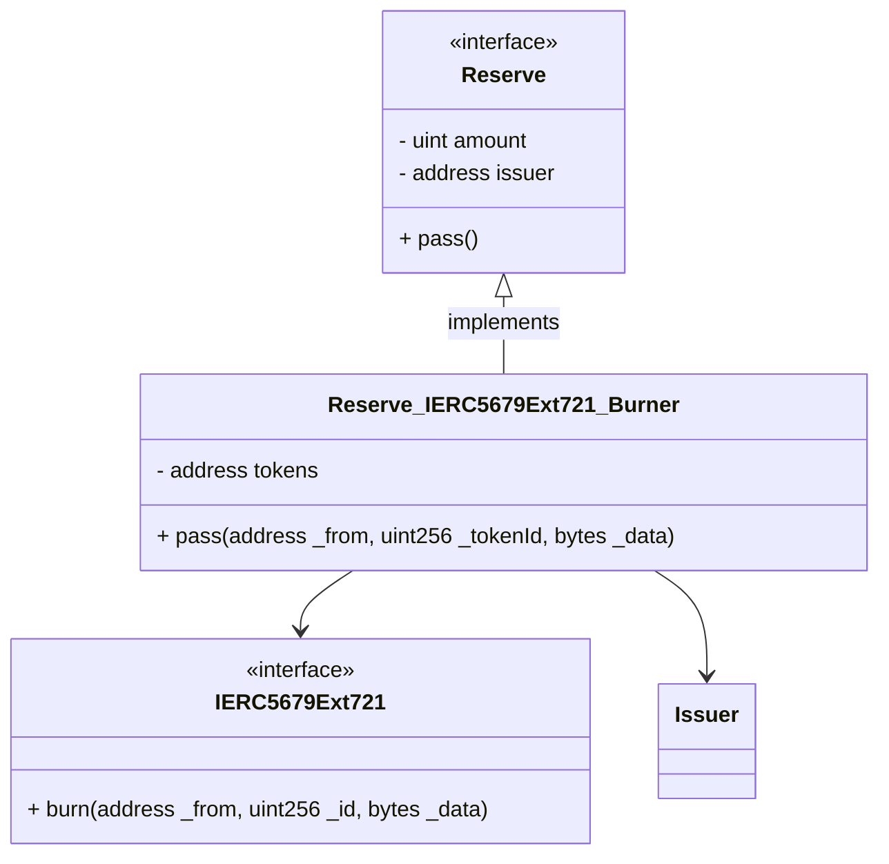
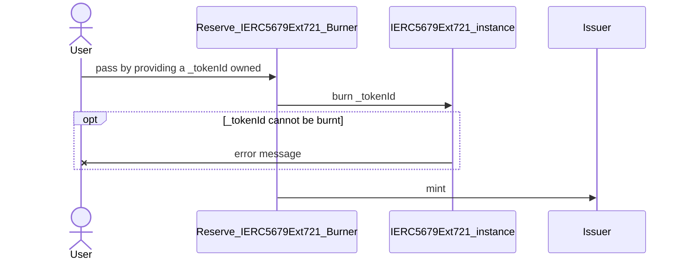
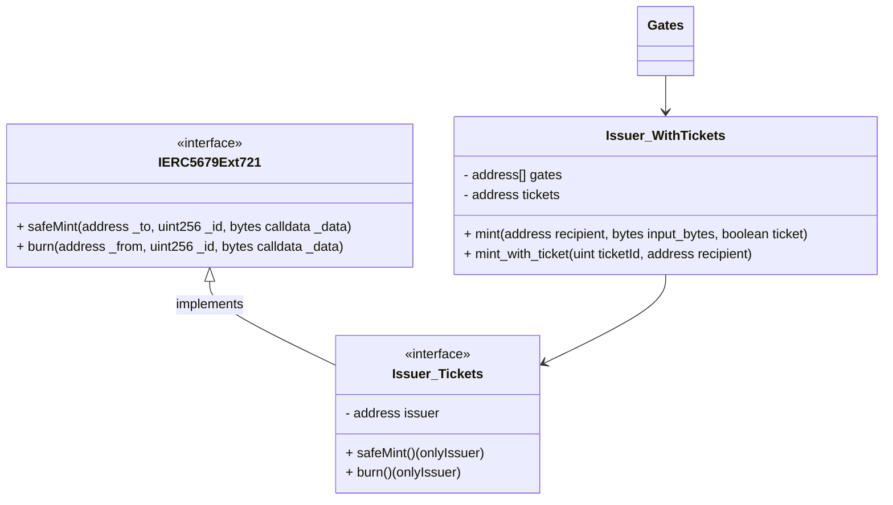
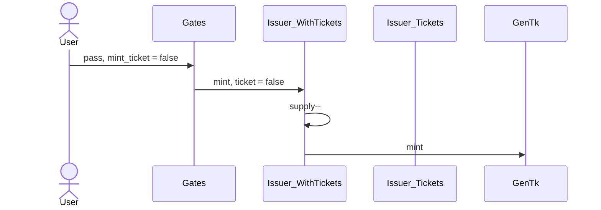
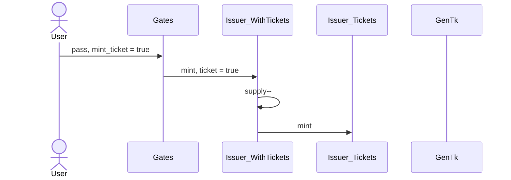
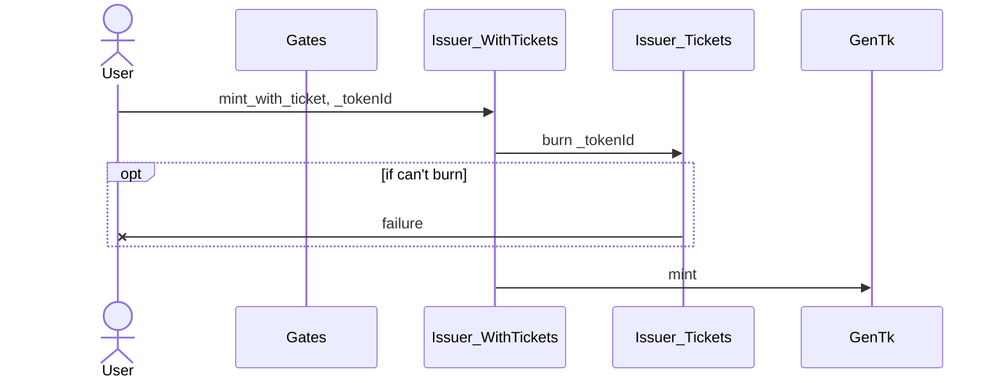
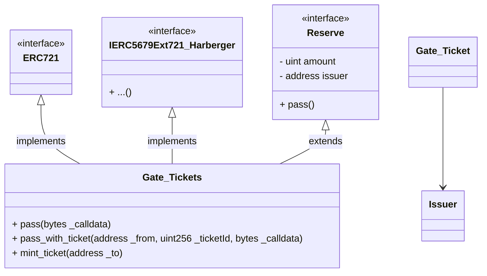
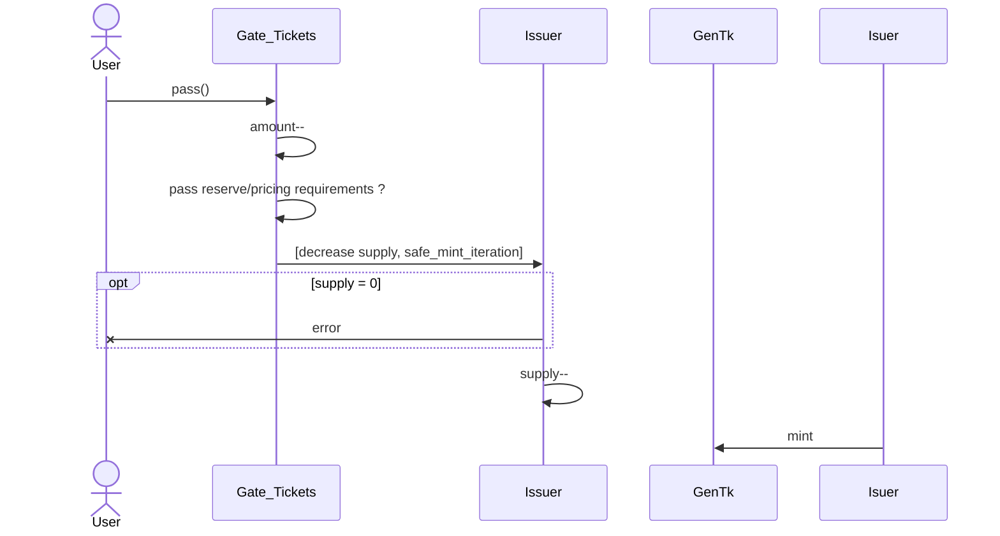
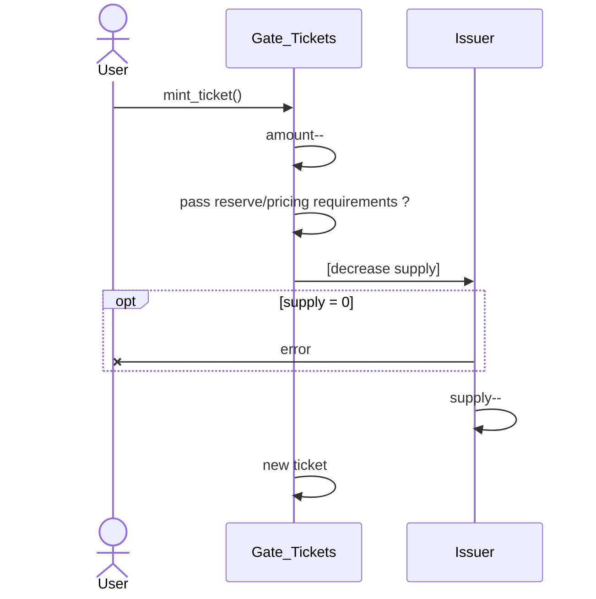
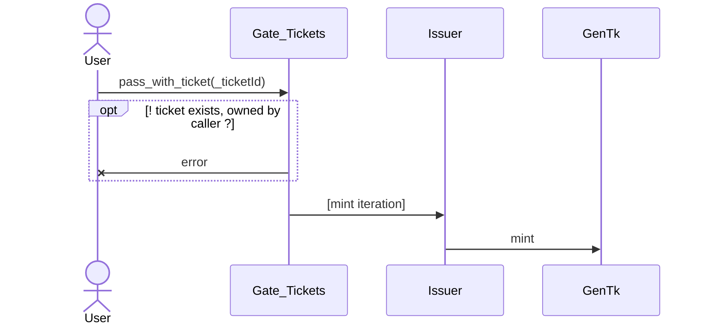

# Rethinking the Tickets system

## Introduction

In the current implementation, Tickets are used to give time to collectors for minting their iteration even for params projects, even when sales are happening fast. This gives them the freedom to purchase a Ticket at sale time, and come back later to mint their params with peace of mind.

The current system forces a Harberger tax model on the Tickets, where:

- a public price must be set by the owners
- tickets can be claimed at any time at their public price
- a daily tax has to be paid, proportional to its public price
  - failure to pay such tax will result in the ticket entering remediation: a 24h dutch auction starting at the public price and linearly decreasing to a resting price of 0.1$ ~
- a grace period, defined by the artist, specifies a duration after minting where
  - owners don't have to pay any tax
  - the tickets cannot be claimed
- assets can be transfered by their owners, but cannot be put on marketplaces: the marketplace is embedded in the ticket system

The current system exhibits the following problems:

- during the grace period, tickets cannot be exchanged on the marketplace
- the logic of the tickets is heavily tied to the issuer contract. The issuer contract must implement some custom logic to process tickets, as opposed to being a more silent processors for mint requests

## Overview of various system components related to tickets

When an Issuer supports tickets, it supports 3 inputs under the hood:

| Operation        | Decrease supply | Mint iteration | Mint ticket |
| ---------------- | :-------------: | :------------: | :---------: |
| mint iteration   |        x        |       x        |      -      |
| mint ticket      |        x        |       -        |      x      |
| mint with ticket |        -        |       x        |      -      |

### Atomic operations on the issuer

A potential path to explore for improving the ticket system is to change the behaviour of the issuer to support atomic operations as opposed to bigger operations:

- `decrement supply`: decrements the supply by 1, throws if not possible
- `mint iteration`: mint an iteration of the GenTk
- `safe mint iteration`: mints an iteration on the GenTK (calls `decrement supply`)
- `mint ticket`: mints a ticket (calls `decrement supply`)
- `burn ticket`: burns a token in the associated tickets contract
- `mint with ticket`: mints an itertion with a ticket (calls `burn ticket` & `mint iteration`)

**!Danger!** The `mint iteration` atomic operation does not decrement the supply, so if manipulated improperly it can mint iterations out of the constraints of the issuer. That's why the `safe mint iteration` atomic operation is also proposed

With this new paradigm, we can maybe unlock possible behaviors by having Gates controlling the issuer with finer details. For instance, we can start thinking of a Gate_Tickets which holds the tickets being minted, and mint tickets. Which would offset the Ticketing logic outside of the issuer.

### A new reseve type: IERC5679Ext721_Burner

While not part of the ticket system, and while it may never be the case, it should be noted that the ticket system is implementing some kind of IERC5679Ext721 burner mechanism. As we'll most likely need to have such a Gate implemented at some point as well, let's describe it.

This is the sequence diagram of a mint when going through a Reserve_IERC5679Ext721_Burner Gate:

## 1. Tickets as any contract implementing IERC5679Ext721

We propose a mechanism where the tickets are handled by any contract implementing IERC5679Ext721. This is a naïve approach, pretty close to the current implementation. However, it still provides the ability to have custom Ticket contracts, which may be required by some organizations. Our base use-case would instanciate a new IERC5679Ext721 ticket contract if a ticket system is required for the project.

_Note: this system doesn't leverage atomic operations on the issuer_

### Flows

#### Mint iteration

#### Mint ticket

#### Mint with ticket

### Notes

- **Pros**
  - proper answer to the specs
- **Cons**
  - the issuer has to implement some logic to support tickets

## 2. Gates as Ticket manager

We propose a system where instead of having the implementation of the tickets logic inside the Issuer, we leverage the atomic operations of the issuer from a Gate which implements the ticket system. It should be noted that as once a ticket is minted, there must be a mechanic ensuring that a Gate holding tickets will always be able to exchange its tickets for an iteration.

With this design, the Gate_Tickets is responsible for implementing the atomic operations to interact with the issuer ([see atomic operations on the issuer](#atomic-operations-on-the-issuer))

### Sequence diagrams

#### Mint iteration

#### Mint ticket

#### Mint with ticket

### Notes

- **Pros**
  - Separation of concerns at the issuer level: issuer becomes simpler
  - Atomic operations on the issuer is _elegant_: it allows for more granular strategies to be implemented
- **Cons**
  - A new gate is added, which adds up a 3rd dimension for the matrix of gates (DutchAuction_PricingFixed_Tickets, DutchAuction_PricingFixed, etc...)
    - rethink packing all the gates into single contracts
    - OR have just the ticket gates be separated (but doesn't work with permanent_gates on the issuer)
  - There is too much logic implemented at the Gate_Issuer level (reserves, pricing, tickets, etc...), so effectively it's shifting complexity from the indexer to way more completxity on many different contracts
    - prone to error

### 3. Gate_Ticket, Ticket_IERC5679Ext721_Harberger

### 4. Gate_Ticket, Ticket_IERC5679Ext721_Harberger, Gate_IERC5679Ext721_Burner

---

# Notes TODO

A ticket is actually just a Gate mechanism, which we can call to have a different entry point where

Potential solutions:

- some gates just decrease the supply
- some gates decrease supply & mint NFTs
- some gates just mint NFTs

Problem:

- ticket as gates could be replaced by another Gate
  - solution: have gates & permanent_gates on the Issuer: some gates cannot be removed
- ticket as gates bring a 2rd dimension to the Gates: we now have to add support to tickets to ALL the potential Gates
- the basic use-case now becomes

The Gate ticket can actually be decomposed into 2 parts:

- generating the NFTs for the tickets
- exchanging a ticket to mint an iteration
