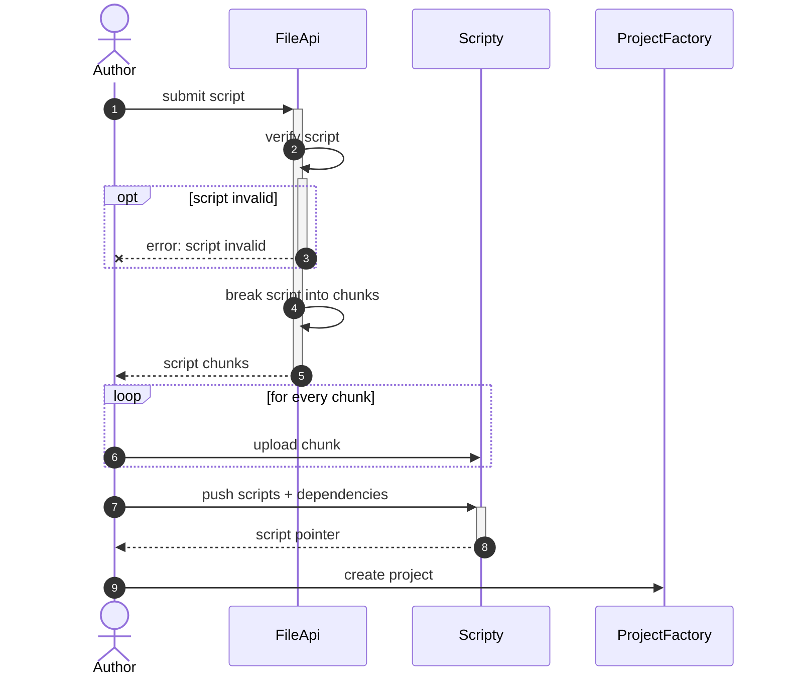
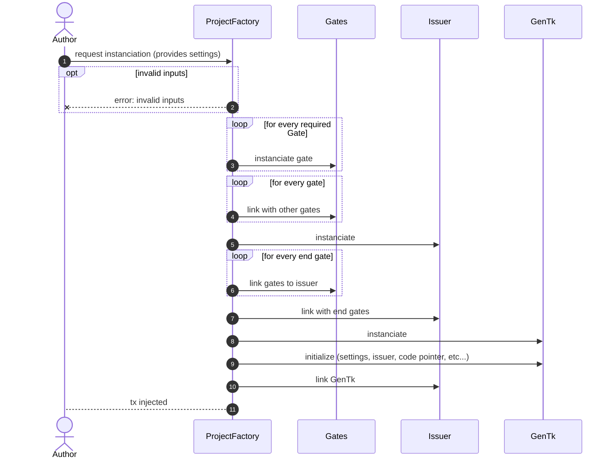
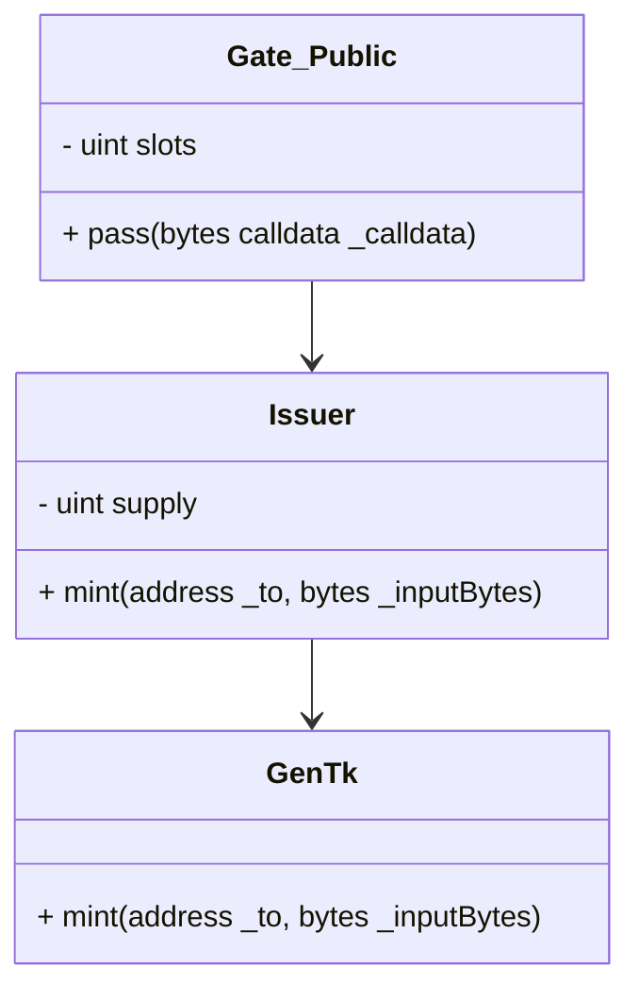
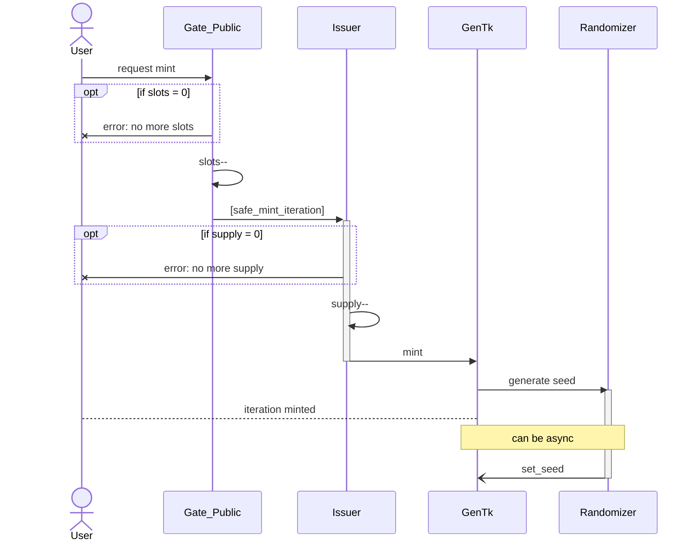
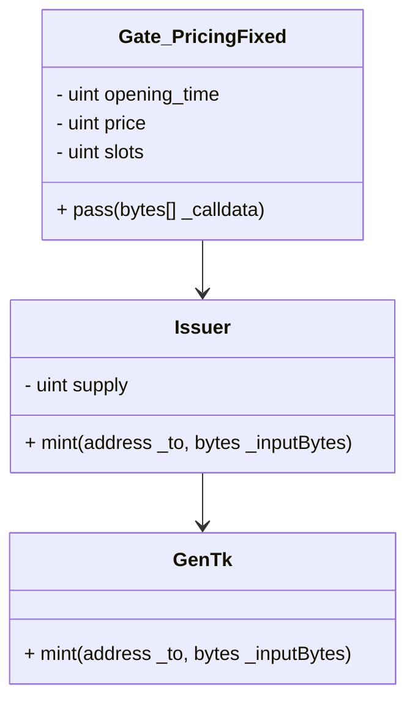
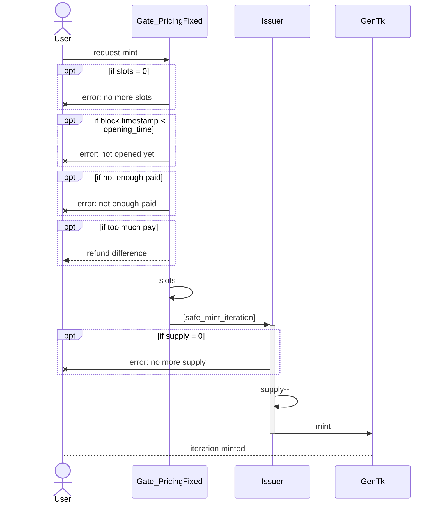
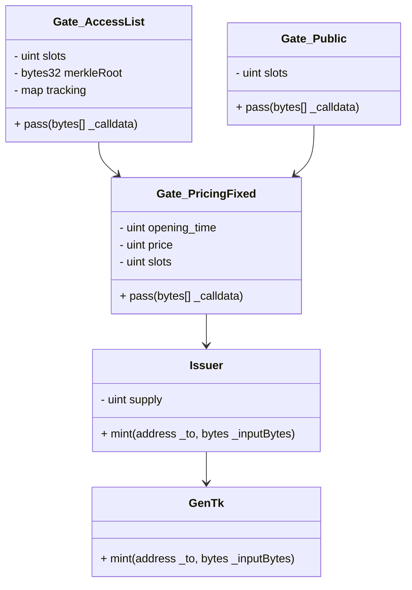
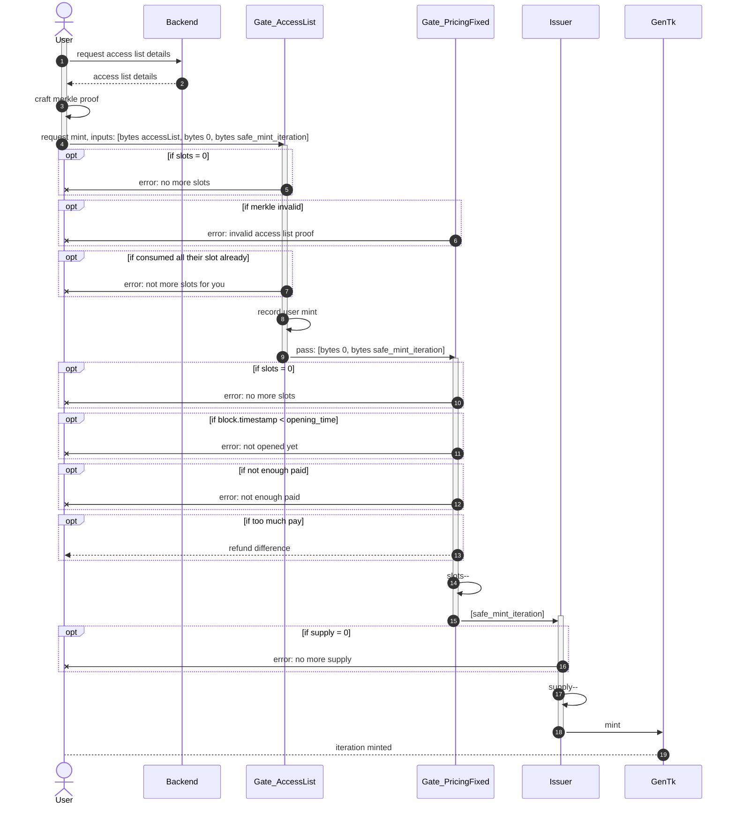

# User flows

> This document describes the various user flows and their execution. For some particular flow, an instance of the deployed contracts will also be described.

## TODOs

- Review:
  - Publishing a project > Overview: properly specify script implementation

## Publishing a project

### Overview

Publishing a project is a 2-step process:

- publish the code
- instanciate the project Smart Contract

### Instanciate the project Smart Contract

## Minting an iteration

### Free mint, full public minting

In this scenario, the issuer has a single gate, which matches its supply.

### Paid minting, using a single pricing & no reserve

- a project simply accepts a fixed pricing
- user must pay the price to mint

### Single pricing, but 2 reserves: public & access list

#### Minting from the public gate

> Almost same as [Free mint full public](#free-mint-full-public-minting), trivial

#### Minting from the access list

